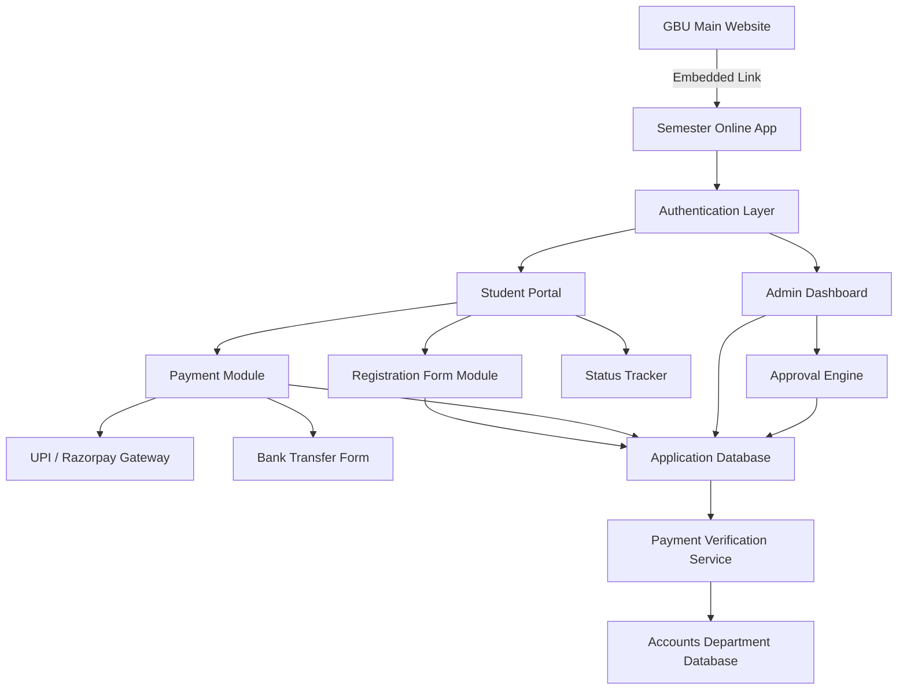
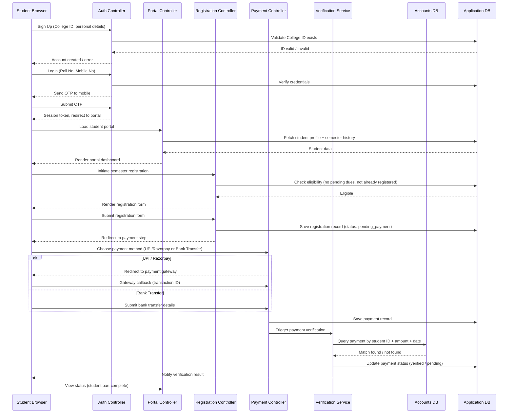
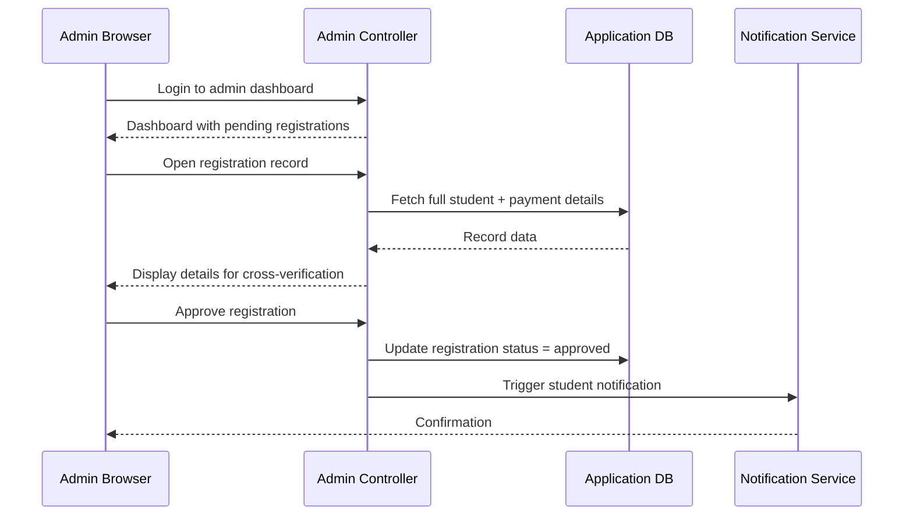

# Design Document: Semester Online Registration System

## Overview

"Semester Online" is a PHP-based web application that digitizes the university's existing offline semester registration and payment process. It integrates with the main GBU university website as an end-part module, allowing enrolled students to register for their current semester, submit payment details, and track approval status — all online. The system enforces strict access control (college students only), links with the Accounts Department database for payment verification, and provides an admin dashboard for final approval.

## Architecture

The system follows a layered MVC architecture with a PHP backend, MySQL databases (application DB + Accounts Department DB), and a session-based authentication layer with MFA support.



## Sequence Diagrams

### Student Registration & Payment Flow



### Admin Approval Flow



## Components and Interfaces

### 1. AuthController

**Purpose**: Handles sign-up, login (MFA), OTP generation/verification, and session management.

**Interface**:
```php
interface AuthControllerInterface {
    public function signUp(array $formData): array;         // returns ['success' => bool, 'errors' => array]
    public function login(string $rollNo, string $mobile): array;
    public function verifyOtp(string $rollNo, string $otp): array;
    public function logout(): void;
    public function isAuthenticated(): bool;
    public function isAdmin(): bool;
}
```

**Responsibilities**:
- Validate College ID against the enrolled students table on sign-up
- Hash passwords using bcrypt before storage
- Generate time-limited OTP (5 minutes), store hashed in DB
- Issue PHP session with role (student / admin) on successful MFA
- Enforce rate limiting on OTP requests (max 3 per 10 minutes)

---

### 2. StudentPortalController

**Purpose**: Renders the student's personal dashboard with profile and semester history.

**Interface**:
```php
interface StudentPortalControllerInterface {
    public function dashboard(int $studentId): array;
    public function getSemesterHistory(int $studentId): array;
    public function getRegistrationStatus(int $studentId, int $semesterId): array;
}
```

**Responsibilities**:
- Aggregate student profile data from the application DB
- Display semester-wise academic and registration records
- Show current registration and payment status

---

### 3. RegistrationController

**Purpose**: Manages the semester registration form submission and eligibility checks.

**Interface**:
```php
interface RegistrationControllerInterface {
    public function checkEligibility(int $studentId, int $semesterId): array;
    public function getRegistrationForm(int $studentId, int $semesterId): array;
    public function submitRegistration(int $studentId, array $formData): array;
}
```

**Responsibilities**:
- Verify student has no pending dues and is not already registered for the semester
- Serve the online form mirroring the offline registration form fields
- Persist registration record with status `pending_payment`

---

### 4. PaymentController

**Purpose**: Handles payment method selection, gateway integration, and bank transfer form submission.

**Interface**:
```php
interface PaymentControllerInterface {
    public function initiatePayment(int $registrationId, string $method): array;
    public function handleGatewayCallback(array $callbackData): array;
    public function submitBankTransfer(int $registrationId, array $transferDetails): array;
    public function getPaymentStatus(int $registrationId): array;
}
```

**Responsibilities**:
- Route to Razorpay SDK or bank transfer form based on student choice
- Record transaction ID / bank transfer reference in the application DB
- Trigger the PaymentVerificationService after payment submission

---

### 5. PaymentVerificationService

**Purpose**: Cross-references submitted payment data against the Accounts Department database.

**Interface**:
```php
interface PaymentVerificationServiceInterface {
    public function verify(int $registrationId): array;   // returns ['verified' => bool, 'message' => string]
    public function pollVerification(int $registrationId): array;
}
```

**Responsibilities**:
- Query Accounts DB using student ID, expected amount, and date range
- Update application DB payment status to `verified` or `pending_manual`
- Support both real-time and scheduled (cron) verification modes

---

### 6. AdminController

**Purpose**: Provides the admin dashboard for reviewing and approving completed registrations.

**Interface**:
```php
interface AdminControllerInterface {
    public function getPendingRegistrations(): array;
    public function getRegistrationDetail(int $registrationId): array;
    public function approveRegistration(int $registrationId, int $adminId): array;
    public function rejectRegistration(int $registrationId, int $adminId, string $reason): array;
}
```

**Responsibilities**:
- List all registrations with status `payment_verified`
- Allow admin to view full student + payment details
- Update registration status to `approved` or `rejected`
- Trigger notification to student on status change

---

### 7. NotificationService

**Purpose**: Sends SMS/email notifications to students on key status changes.

**Interface**:
```php
interface NotificationServiceInterface {
    public function sendOtp(string $mobile, string $otp): bool;
    public function sendStatusUpdate(int $studentId, string $status, string $message): bool;
}
```

---

## Data Models

### students

```sql
CREATE TABLE students (
    id              INT UNSIGNED AUTO_INCREMENT PRIMARY KEY,
    college_id      VARCHAR(20) NOT NULL UNIQUE,   -- Roll No / Registration No
    full_name       VARCHAR(100) NOT NULL,
    mobile          VARCHAR(15) NOT NULL UNIQUE,
    email           VARCHAR(100),
    department      VARCHAR(100),
    program         VARCHAR(100),
    current_semester TINYINT UNSIGNED,
    password_hash   VARCHAR(255) NOT NULL,
    is_active       TINYINT(1) DEFAULT 1,
    created_at      TIMESTAMP DEFAULT CURRENT_TIMESTAMP
);
```

**Validation Rules**:
- `college_id` must exist in the enrolled students master list before account creation
- `mobile` must be a valid 10-digit Indian mobile number
- `password_hash` stored as bcrypt (cost factor ≥ 12)

---

### otp_tokens

```sql
CREATE TABLE otp_tokens (
    id          INT UNSIGNED AUTO_INCREMENT PRIMARY KEY,
    student_id  INT UNSIGNED NOT NULL,
    otp_hash    VARCHAR(255) NOT NULL,
    expires_at  TIMESTAMP NOT NULL,
    used        TINYINT(1) DEFAULT 0,
    created_at  TIMESTAMP DEFAULT CURRENT_TIMESTAMP,
    FOREIGN KEY (student_id) REFERENCES students(id)
);
```

---

### registrations

```sql
CREATE TABLE registrations (
    id              INT UNSIGNED AUTO_INCREMENT PRIMARY KEY,
    student_id      INT UNSIGNED NOT NULL,
    semester_id     TINYINT UNSIGNED NOT NULL,
    academic_year   VARCHAR(9) NOT NULL,           -- e.g. "2024-2025"
    subjects        JSON NOT NULL,                 -- array of subject codes enrolled
    hostel_required TINYINT(1) DEFAULT 0,
    transport       VARCHAR(50),
    remarks         TEXT,
    status          ENUM('draft','pending_payment','payment_submitted',
                         'payment_verified','approved','rejected') DEFAULT 'draft',
    submitted_at    TIMESTAMP NULL,
    created_at      TIMESTAMP DEFAULT CURRENT_TIMESTAMP,
    FOREIGN KEY (student_id) REFERENCES students(id)
);
```

---

### payments

```sql
CREATE TABLE payments (
    id                  INT UNSIGNED AUTO_INCREMENT PRIMARY KEY,
    registration_id     INT UNSIGNED NOT NULL UNIQUE,
    student_id          INT UNSIGNED NOT NULL,
    amount              DECIMAL(10,2) NOT NULL,
    payment_method      ENUM('upi','razorpay','bank_transfer') NOT NULL,
    transaction_ref     VARCHAR(100),              -- gateway txn ID or bank UTR
    bank_name           VARCHAR(100),
    account_holder      VARCHAR(100),
    transfer_date       DATE,
    transfer_amount     DECIMAL(10,2),
    receipt_path        VARCHAR(255),              -- uploaded receipt file path
    verification_status ENUM('pending','verified','failed') DEFAULT 'pending',
    verified_at         TIMESTAMP NULL,
    created_at          TIMESTAMP DEFAULT CURRENT_TIMESTAMP,
    FOREIGN KEY (registration_id) REFERENCES registrations(id),
    FOREIGN KEY (student_id) REFERENCES students(id)
);
```

---

### admin_actions

```sql
CREATE TABLE admin_actions (
    id              INT UNSIGNED AUTO_INCREMENT PRIMARY KEY,
    registration_id INT UNSIGNED NOT NULL,
    admin_id        INT UNSIGNED NOT NULL,
    action          ENUM('approved','rejected') NOT NULL,
    notes           TEXT,
    acted_at        TIMESTAMP DEFAULT CURRENT_TIMESTAMP,
    FOREIGN KEY (registration_id) REFERENCES registrations(id)
);
```

---

## Algorithmic Pseudocode

### Sign-Up Algorithm

```pascal
PROCEDURE signUp(formData)
  INPUT: formData {college_id, full_name, mobile, email, password, confirm_password}
  OUTPUT: result {success: bool, errors: array}

  BEGIN
    errors ← []

    IF formData.password ≠ formData.confirm_password THEN
      errors.add("Passwords do not match")
    END IF

    IF NOT isValidMobile(formData.mobile) THEN
      errors.add("Invalid mobile number")
    END IF

    IF NOT collegeIdExistsInMasterList(formData.college_id) THEN
      errors.add("College ID not found. Only enrolled students may register.")
    END IF

    IF studentAccountExists(formData.college_id) THEN
      errors.add("An account already exists for this College ID.")
    END IF

    IF errors.length > 0 THEN
      RETURN {success: false, errors: errors}
    END IF

    hash ← bcrypt(formData.password, cost=12)
    student ← createStudentRecord(formData, hash)
    sendWelcomeSms(formData.mobile)

    RETURN {success: true, errors: []}
  END
END PROCEDURE
```

**Preconditions:**
- `formData` contains all required fields (non-empty)
- `collegeIdExistsInMasterList` queries the enrolled students master table

**Postconditions:**
- If successful: a new row exists in `students` with `is_active = 1`
- Password is never stored in plaintext
- College ID uniqueness is enforced at DB level

---

### MFA Login Algorithm

```pascal
PROCEDURE login(rollNo, mobile)
  INPUT: rollNo (string), mobile (string)
  OUTPUT: result {success: bool, message: string}

  BEGIN
    student ← findStudentByRollNo(rollNo)

    IF student IS NULL THEN
      RETURN {success: false, message: "Invalid credentials"}
    END IF

    IF student.mobile ≠ mobile THEN
      RETURN {success: false, message: "Invalid credentials"}
    END IF

    IF student.is_active = 0 THEN
      RETURN {success: false, message: "Account is deactivated"}
    END IF

    IF otpRequestCount(student.id, last=10 minutes) ≥ 3 THEN
      RETURN {success: false, message: "Too many OTP requests. Try after 10 minutes."}
    END IF

    otp ← generateNumericOtp(length=6)
    otpHash ← bcrypt(otp, cost=10)
    storeOtpToken(student.id, otpHash, expiresIn=5 minutes)
    sendOtpSms(mobile, otp)

    RETURN {success: true, message: "OTP sent to registered mobile"}
  END
END PROCEDURE

PROCEDURE verifyOtp(rollNo, submittedOtp)
  INPUT: rollNo (string), submittedOtp (string)
  OUTPUT: result {success: bool, sessionToken: string}

  BEGIN
    student ← findStudentByRollNo(rollNo)
    token ← getLatestUnusedOtpToken(student.id)

    IF token IS NULL OR token.expires_at < NOW() THEN
      RETURN {success: false, message: "OTP expired or not found"}
    END IF

    IF NOT bcrypt_verify(submittedOtp, token.otp_hash) THEN
      RETURN {success: false, message: "Invalid OTP"}
    END IF

    markOtpTokenUsed(token.id)
    session ← createSession(student.id, role="student")

    RETURN {success: true, sessionToken: session.token}
  END
END PROCEDURE
```

**Preconditions:**
- `rollNo` and `mobile` are non-empty strings
- OTP is 6 digits, numeric only

**Postconditions (verifyOtp):**
- OTP token is marked used; cannot be reused
- PHP session is created with `student_id` and `role`
- Session expires after 30 minutes of inactivity

**Loop Invariants:** N/A

---

### Registration Eligibility Check Algorithm

```pascal
PROCEDURE checkEligibility(studentId, semesterId)
  INPUT: studentId (int), semesterId (int)
  OUTPUT: result {eligible: bool, reason: string}

  BEGIN
    student ← fetchStudent(studentId)

    IF student.current_semester ≠ semesterId THEN
      RETURN {eligible: false, reason: "Semester mismatch"}
    END IF

    existingReg ← findRegistration(studentId, semesterId, academicYear=currentYear())
    IF existingReg IS NOT NULL AND existingReg.status ≠ 'rejected' THEN
      RETURN {eligible: false, reason: "Already registered for this semester"}
    END IF

    pendingDues ← checkPendingDues(studentId)
    IF pendingDues > 0 THEN
      RETURN {eligible: false, reason: "Pending dues of ₹" + pendingDues}
    END IF

    RETURN {eligible: true, reason: ""}
  END
END PROCEDURE
```

**Preconditions:**
- Student session is authenticated
- `semesterId` corresponds to the current active semester

**Postconditions:**
- Returns eligibility without mutating any state

---

### Payment Verification Algorithm

```pascal
PROCEDURE verifyPayment(registrationId)
  INPUT: registrationId (int)
  OUTPUT: result {verified: bool, message: string}

  BEGIN
    payment ← fetchPayment(registrationId)
    student ← fetchStudent(payment.student_id)

    IF payment.payment_method IN ['upi', 'razorpay'] THEN
      gatewayResult ← queryPaymentGateway(payment.transaction_ref)
      IF gatewayResult.status = 'captured' THEN
        updatePaymentStatus(payment.id, 'verified')
        updateRegistrationStatus(registrationId, 'payment_verified')
        RETURN {verified: true, message: "Payment verified via gateway"}
      ELSE
        RETURN {verified: false, message: "Gateway payment not confirmed"}
      END IF
    END IF

    IF payment.payment_method = 'bank_transfer' THEN
      accRecord ← queryAccountsDB(
        studentId   = student.college_id,
        amount      = payment.transfer_amount,
        dateRange   = [payment.transfer_date - 2 days, payment.transfer_date + 2 days]
      )

      IF accRecord IS NOT NULL THEN
        updatePaymentStatus(payment.id, 'verified')
        updateRegistrationStatus(registrationId, 'payment_verified')
        notifyStudent(student.id, "Payment verified. Awaiting admin approval.")
        RETURN {verified: true, message: "Bank transfer matched in Accounts DB"}
      ELSE
        updatePaymentStatus(payment.id, 'pending')
        RETURN {verified: false, message: "No matching record in Accounts DB. Will retry."}
      END IF
    END IF
  END
END PROCEDURE
```

**Preconditions:**
- `registrationId` exists and has status `payment_submitted`
- Accounts DB connection is available

**Postconditions:**
- If verified: `payments.verification_status = 'verified'`, `registrations.status = 'payment_verified'`
- If not verified: status remains `pending`; a scheduled cron job retries every 6 hours

**Loop Invariants:** N/A

---

### Admin Approval Algorithm

```pascal
PROCEDURE approveRegistration(registrationId, adminId)
  INPUT: registrationId (int), adminId (int)
  OUTPUT: result {success: bool, message: string}

  BEGIN
    registration ← fetchRegistration(registrationId)

    IF registration IS NULL THEN
      RETURN {success: false, message: "Registration not found"}
    END IF

    IF registration.status ≠ 'payment_verified' THEN
      RETURN {success: false, message: "Registration is not in a verifiable state"}
    END IF

    updateRegistrationStatus(registrationId, 'approved')
    logAdminAction(registrationId, adminId, action='approved')
    notifyStudent(registration.student_id, "Your semester registration has been approved.")

    RETURN {success: true, message: "Registration approved successfully"}
  END
END PROCEDURE
```

**Preconditions:**
- Admin session is authenticated with `role = 'admin'`
- Registration status must be `payment_verified`

**Postconditions:**
- `registrations.status = 'approved'`
- Admin action logged in `admin_actions`
- Student receives SMS/email notification

---

## Key Functions with Formal Specifications

### `collegeIdExistsInMasterList(string $collegeId): bool`

**Preconditions:**
- `$collegeId` is a non-empty string
- Master list table (enrolled students) is accessible in the DB

**Postconditions:**
- Returns `true` if and only if `$collegeId` exists in the enrolled students master table
- No mutations to any table

---

### `generateNumericOtp(int $length): string`

**Preconditions:**
- `$length` is a positive integer (typically 6)

**Postconditions:**
- Returns a string of exactly `$length` numeric digits
- Generated using a cryptographically secure random source (`random_int`)
- Each call produces an independent, uniformly distributed value

---

### `queryAccountsDB(string $collegeId, float $amount, array $dateRange): ?array`

**Preconditions:**
- `$collegeId` is non-empty
- `$amount > 0`
- `$dateRange` is a two-element array `[startDate, endDate]` where `startDate <= endDate`
- Read-only access to Accounts DB

**Postconditions:**
- Returns the first matching payment record or `null` if none found
- Does not mutate the Accounts DB
- Uses a dedicated read-only DB connection

---

### `updateRegistrationStatus(int $registrationId, string $status): bool`

**Preconditions:**
- `$registrationId` exists in `registrations`
- `$status` is one of the valid ENUM values

**Postconditions:**
- `registrations.status` is updated to `$status`
- Returns `true` on success, `false` on DB error
- Status transitions are one-directional (no rollback to earlier states)

---

## Error Handling

### Invalid College ID on Sign-Up

**Condition**: Student submits a College ID not present in the enrolled students master list.
**Response**: Return validation error "College ID not found. Only enrolled students may register." Do not create account.
**Recovery**: Student must contact the university registrar to verify enrollment.

---

### OTP Expired or Invalid

**Condition**: Student submits an OTP after 5-minute expiry or enters wrong digits.
**Response**: Return error "OTP expired or invalid." Invalidate the token.
**Recovery**: Student can request a new OTP (subject to rate limit of 3 per 10 minutes).

---

### Accounts DB Unavailable

**Condition**: The Accounts Department DB connection fails during payment verification.
**Response**: Log the error, set payment status to `pending`, return a user-friendly message "Verification is in progress. You will be notified."
**Recovery**: Cron job retries verification every 6 hours. Admin can also trigger manual verification.

---

### Duplicate Registration Attempt

**Condition**: Student attempts to register for a semester they are already registered for.
**Response**: Eligibility check returns `eligible: false` with reason. Block form submission.
**Recovery**: Student is redirected to their existing registration status page.

---

### Payment Gateway Callback Failure

**Condition**: Razorpay/UPI callback does not arrive (network issue).
**Response**: Payment status remains `pending`. Student portal shows "Payment pending confirmation."
**Recovery**: Student can check status; admin can manually verify and update if needed.

---

## Testing Strategy

### Unit Testing Approach

Test each controller method and service function in isolation using PHPUnit. Key test cases:
- `signUp()` with valid data → account created
- `signUp()` with unrecognized College ID → error returned
- `login()` with mismatched mobile → error returned
- `verifyOtp()` with expired token → error returned
- `checkEligibility()` with pending dues → ineligible
- `verifyPayment()` with matching Accounts DB record → verified

### Property-Based Testing Approach

**Property Test Library**: PHPUnit with custom data providers (or `eris` library for PHP property-based testing)

Key properties to verify:
- For any College ID not in the master list, `signUp()` must always return `success: false`
- For any OTP submitted after expiry time, `verifyOtp()` must always return `success: false`
- For any registration not in `payment_verified` status, `approveRegistration()` must always return `success: false`
- `generateNumericOtp(6)` always returns a string of exactly 6 numeric characters

### Integration Testing Approach

- Test the full sign-up → login → registration → payment → verification → approval flow end-to-end using a test database
- Mock the Accounts DB with known fixture data to test payment verification matching
- Mock the Razorpay SDK to test gateway callback handling

---

## Performance Considerations

- Accounts DB queries during payment verification should use indexed lookups on `college_id` and `transfer_date`
- OTP token table should be purged of expired tokens via a scheduled cron job to prevent table bloat
- Student portal dashboard queries should be cached per session (5-minute TTL) to reduce DB load during peak registration periods
- Razorpay webhook endpoint must respond within 5 seconds to avoid gateway retries

---

## Security Considerations

- **Access Control**: College ID validation at sign-up is the primary enrollment gate. All routes are protected by session middleware checking `role`.
- **SQL Injection**: All DB queries use PDO prepared statements. The Accounts DB connection uses a separate read-only credential.
- **CSRF Protection**: All POST forms include a CSRF token validated server-side.
- **Password Storage**: bcrypt with cost factor ≥ 12.
- **OTP Security**: OTPs are hashed before storage; raw OTP is never persisted. Rate limiting prevents brute force.
- **File Uploads** (bank transfer receipts): Validated for MIME type (PDF/JPEG/PNG), stored outside the web root, served via a controller with session check.
- **HTTPS**: The entire application must be served over TLS. HTTP requests redirected to HTTPS.
- **Session Hardening**: `session.cookie_httponly = 1`, `session.cookie_secure = 1`, `session.use_strict_mode = 1`. Session regenerated on privilege change.

---

## Dependencies

| Dependency | Purpose |
|---|---|
| PHP 8.1+ | Backend runtime |
| MySQL 8.0+ | Application database |
| Accounts Dept. MySQL/Oracle DB | Payment cross-reference (read-only access) |
| Razorpay PHP SDK | UPI / card payment gateway |
| PHPMailer or SMTP service | Email notifications |
| SMS Gateway API (e.g., MSG91, Twilio) | OTP and status SMS delivery |
| PHPUnit | Unit and integration testing |
| Composer | PHP dependency management |
| Apache / Nginx | Web server with mod_rewrite / try_files |
| Let's Encrypt / SSL Certificate | HTTPS enforcement |

---

## Correctness Properties

*A property is a characteristic or behavior that should hold true across all valid executions of a system — essentially, a formal statement about what the system should do. Properties serve as the bridge between human-readable specifications and machine-verifiable correctness guarantees.*

---

### Property 1: Invalid College ID always rejected at sign-up

*For any* string that does not exist in the enrolled students Master_List, calling `signUp()` with that College ID must always return `success: false` and must never create a student record.

**Validates: Requirements 1.1**

---

### Property 2: Duplicate College ID always rejected at sign-up

*For any* College ID for which a student account already exists, a second `signUp()` call with that College ID must always return `success: false` and must not create a second record.

**Validates: Requirements 1.2**

---

### Property 3: Invalid sign-up inputs always rejected

*For any* sign-up form where the password and confirm_password fields are not equal, or where the mobile number is not a valid 10-digit Indian mobile number, `signUp()` must return `success: false` and must not create a student record.

**Validates: Requirements 1.3, 1.4**

---

### Property 4: Passwords are never stored in plaintext

*For any* password string submitted during sign-up, the value stored in the `password_hash` column must not equal the original plaintext password and must be a valid bcrypt hash with cost factor ≥ 12.

**Validates: Requirements 1.6, 10.7**

---

### Property 5: Invalid login credentials always rejected

*For any* combination of roll number and mobile number where either the roll number does not exist, the mobile does not match the stored value, or the account has `is_active = 0`, calling `login()` must always return `success: false`.

**Validates: Requirements 2.1, 2.2, 2.3**

---

### Property 6: OTP rate limiting enforced

*For any* student, after 3 OTP requests within a 10-minute window, any further `login()` call within that window must return `success: false` with the rate-limit message, regardless of credential validity.

**Validates: Requirements 2.4, 10.6**

---

### Property 7: OTP format invariant

*For any* call to `generateNumericOtp(6)`, the returned value must be a string of exactly 6 characters where every character is a decimal digit (0–9).

**Validates: Requirements 2.5, 12.1**

---

### Property 8: OTP is never stored in plaintext

*For any* OTP generated and stored in the `otp_tokens` table, the `otp_hash` column value must not equal the raw OTP string and must be a valid bcrypt hash.

**Validates: Requirements 2.5, 12.3, 10.8**

---

### Property 9: Expired OTP always rejected

*For any* OTP token whose `expires_at` timestamp is in the past, calling `verifyOtp()` with that token's value must always return `success: false`.

**Validates: Requirements 2.6, 12.5**

---

### Property 10: Used OTP cannot be reused

*For any* OTP token that has been successfully used for authentication (marked `used = 1`), a subsequent call to `verifyOtp()` with the same OTP value must return `success: false`.

**Validates: Requirements 2.8, 12.4**

---

### Property 11: Eligibility check is read-only (pure function)

*For any* student ID and semester ID, calling `checkEligibility()` any number of times must produce the same result without mutating any row in the Application_DB.

**Validates: Requirements 4.5**

---

### Property 12: Ineligible students cannot register

*For any* student who fails any eligibility condition (semester mismatch, existing non-rejected registration, or pending dues > 0), calling `submitRegistration()` must return an error and must not create a registration record.

**Validates: Requirements 4.1, 4.2, 4.3, 5.3**

---

### Property 13: Registration submission creates correct initial state

*For any* eligible student submitting a valid registration form, the resulting registration record must have `status = 'pending_payment'` and a non-null `submitted_at` timestamp.

**Validates: Requirements 5.1, 5.2**

---

### Property 14: Subjects JSON round-trip

*For any* array of subject codes submitted in a registration form, serializing to JSON for storage and then deserializing must produce an array equivalent to the original input.

**Validates: Requirements 5.4**

---

### Property 15: Payment submission only allowed from pending_payment status

*For any* registration whose status is not `pending_payment`, calling `initiatePayment()` or `submitBankTransfer()` must return an error and must not create or modify a payment record.

**Validates: Requirements 6.5**

---

### Property 16: Gateway payment verification outcome is deterministic

*For any* payment record with method `upi` or `razorpay`, if the payment gateway returns status `captured` then `verify()` must set `verification_status = 'verified'` and `registration.status = 'payment_verified'`; if the gateway returns any other status then `verify()` must return `verified: false` and must not update the registration status.

**Validates: Requirements 7.1, 7.2**

---

### Property 17: Bank transfer verification matches on correct criteria

*For any* bank transfer payment record, `verify()` must return `verified: true` if and only if the Accounts_DB contains a record matching the student's college ID, the submitted amount, and a transfer date within ±2 days of the recorded transfer date.

**Validates: Requirements 7.3, 7.4**

---

### Property 18: Accounts_DB is never mutated by verification

*For any* call to `verify()` or `pollVerification()`, the Accounts_DB must contain exactly the same rows before and after the call.

**Validates: Requirements 7.7**

---

### Property 19: Admin dashboard shows only payment_verified registrations

*For any* set of registrations in the Application_DB, `getPendingRegistrations()` must return only those records whose `status = 'payment_verified'` and must not include records in any other status.

**Validates: Requirements 8.1**

---

### Property 20: Admin approval/rejection only allowed from payment_verified status

*For any* registration whose status is not `payment_verified`, calling `approveRegistration()` or `rejectRegistration()` must return an error and must not modify the registration record or create an `admin_actions` entry.

**Validates: Requirements 8.5**

---

### Property 21: Admin action is fully recorded

*For any* successful `approveRegistration()` or `rejectRegistration()` call, the `admin_actions` table must contain a new row with the correct `registration_id`, `admin_id`, `action` value, and a non-null `acted_at` timestamp.

**Validates: Requirements 8.3, 8.4, 8.7, 11.4**

---

### Property 22: Registration status transitions are strictly forward

*For any* registration record, calling `updateRegistrationStatus()` with a status that precedes the current status in the lifecycle (`draft` → `pending_payment` → `payment_submitted` → `payment_verified` → `approved`/`rejected`) must return `false` and must not modify the record.

**Validates: Requirements 11.1, 11.2**

---

### Property 23: CSRF protection rejects requests without valid token

*For any* POST request to any system endpoint that does not include a valid CSRF token matching the current session, the System must reject the request and must not process the submitted data.

**Validates: Requirements 10.2**

---

### Property 24: Non-admin sessions cannot access admin routes

*For any* session with `role = 'student'` or with no active session, any request to an admin dashboard route must be denied and must not return any registration or student data.

**Validates: Requirements 8.6, 10.10**
